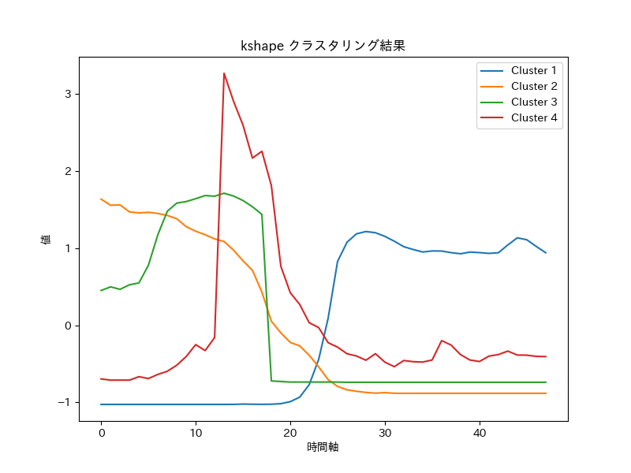

# 東京ディズニーランド・ディズニーシー巡回路最適化AI


## 概要
このアプリは、東京ディズニーランド・ディズニーシーを効率的に楽しむための巡回路を最適化する人工知能（AI）です。待ち時間の予測やアトラクション間の歩数予測を行い、**優先順位の高いアトラクションを選びながら、来園予定日の最適な巡回ルート**を提案します。

### データの取得

予測実施日当日のデータは取得できないため、1日前のデータを取得する。

（例）予測実施日4/3のとき、データは、4/2までのデータを取得。

- [気象庁 過去の気象データ検索](https://www.data.jma.go.jp/obd/stats/etrn/index.php?prec_no=&block_no=&year=&month=&day=&view=)から東京の天気データを取得


- [ディズニー待ち時間の過去データと現在データ](https://urtrip.jp/disneyland-menu/)からデータを取得


参考：https://nttdocomo-developers.jp/entry/202212241200_2


※ robots.txt及び免責事項確認済み

```
User-agent: *
Disallow: /wp-admin/
Allow: /wp-admin/admin-ajax.php

Sitemap: https://urtrip.jp/sitemap.xml
```


### 前処理

下記の順で、アトラクション及び日付の粒度で待ち時間の前処理をしている。


1. 外れ値除去

max_value以上の値は、max_valueに置き換える。
min_value以下の値は、min_valueに置き換える。

2. 異常値検知

th_annomaly以上に待ち時間が増減しているとき、値を欠損値に置き換える。

3. 欠損値補完

欠損値を線形内挿外挿補完する。

### 待ち時間予測

1. アトラクション、曜日の粒度で平均した待ち時間の時系列をkshapeでクラスタリング
2. クラスタリング結果に基づいてlightgbmでモデルを学習及び予測

#### kshape
アトラクション毎に曜日の粒度で平均した待ち時間の時系列データ（7×アトラクション数の時系列データ）を用いてkshapeでクラスタリングする。

kshapeのcentroidは以下のようになる。




#### lightgbm
クラスタ毎にlightgbmを学習し、クラスタ毎にモデルを作成する。
パラメータは共通のものを使用する。


参考として、学習データと評価データに対する予測結果は以下の表に示す。
以下では、各クラスタで予測した結果を結合した予測値を評価したものである。
評価データは直近の42日間のデータを使用した。

||mae|rmse|
|---|---|---|
|train|6.84|12.11|
|valid|4.42|7.66|


### アトラクション間歩数予測

[ディズニー移動時間、距離、歩数サイト](https://disney.hosuu.jp/)からアトラクション間の歩数を取得して使用

1. 座標間距離をヒュベニの公式を用いて算出
2. 座標間距離から歩数を予測する単回帰式を学習
3. 歩数情報がないアトラクションの歩数を単回帰で予測

一歩当たりの秒数を調整することで、移動時間の調整が可能

`opt_config.yaml`内の`cost.step_time`を調整

### 巡回路最適化

予測された各アトラクションの待ち時間を受け取り、事前に設定した優先順位が高い乗り物をより多く乗れるようにpulpを用いて最適化

#### 定式化

優先度と来訪数を最大化する目的関数

$maximize(\sum_{i}p_{i}y_{i})$

$s.t.$
  
* 各アトラクションに1度しか訪れない制約

  $\sum_{t}\sum_{i:i\neq{j}}x_{tij} = y_{i}$ 

  $\sum_{t}\sum_{i:i\neq{j}}x_{tji} = y_{i}$

* 離散的な時刻の制約

  $\sum_{i:i\neq{j}}u_{ji} \leq \sum_{t}\sum_{i:i\neq{j}}Mtx_{tij}$ 

* 離散的な時刻のMTZ制約

  $\sum_{t}\sum_{i:i\neq{j}}Mtx_{tij} \leq \sum_{t}\sum_{k:k\neq{j}}Mtx_{tjk}$ 

* 各アトラクションの出発時刻のMTZ制約

  $\sum_{i:i\neq{j}}(u_{ij}+\sum_{t}C_{i-1,j-1}^{t}x_{tij}) \leq\sum_{k:k\neq{j}}u_{jk}$

* パーク滞在の最大時間制約(帰宅時間を過ぎないようにする制約)

  $\sum_{j:j\neq{i}}u_{ij} \leq W_{i}\sum_{t}\sum_{j:j\neq{i}}x_{tij}$


* 各アトラクションの時間枠制約

  $\sum_{j:j\neq{i}}u_{ij} \leq S$

  $0 \leq \sum_{j:j\neq{i}}u_{ij}$

* 時刻tにアトラクションiからアトラクションjへ移動するかどうかを表す変数

  $x_{tij} \in [0,1]$

* アトラクションiに行くかどうかを表す変数

  $y_{i} \in [0,1]$

* アトラクションiの出発時刻を表す変数

  $u_{ij} \in \R$

* その他定数

  $M: 待ち時間予測の間隔（秒）(ex:15分間隔の予測ならば、15 \times 60)$

  $S: 最大滞在時間（秒）$

  $C_{i-1,j-1}: 時間のコスト行列（0は開始地点を表す）$

  $W_{i}: アトラクションiのウィンドウの上限$


## 使い方

### 実行環境

- OS: Ubuntu20.04
- CPU: Rythen7 3700X
- GPU: GEFORCE RTX2070 SUPER
- MEMORY: 32GB

GPUは必要ないが、CPUとMemoryは多く確保したい
### 実行前の設定

1. 日付と時間の設定

`config/common_config.yaml`を編集することを推奨します。

※CLIのparserでも設定可能

学習開始日以外は、適宜変更する必要があります。
```
  train_start_date: "2022-4-25" # 学習開始日
  predict_date: "2023-08-20" # 予測実施日
  visit_date: "2023-08-21" #来園予定日
  visit_time: "09:00" #来園時刻
  return_time: "20:30" #退園時刻
```

2. アトラクションの優先順位の設定

`disney_route_optimize/config/{tdl or tds}/rank.csv`
で各アトラクションの優先順位をつけてください。
順位は自然数で値が小さいほど優先度は高くなります。

* 故障中や運航停止、乗りたくないアトラクションは`-1`を入れてください。
最適化から除外されます。

* 順位を入れない場合、順位が入っていないアトラクションは名前の降順に自動的に順位が入れられます。


### 実行方法


次のコマンドを実行するとデータの取得　-> 学習 -> 予測 -> 可視化が完了する。
```python
python disney_route_optimize/src/main.py
```

上記コマンドを実行する際、以下のパラメータをcliで設定して実行することができる。
yamlを直接変更してもよい
```
  --load_from LOAD_FROM
                        学習済みモデルをloadする場合は指定：result直下のディレクトリを指定（result/hogehoge）
  --land_type LAND_TYPE
                        対象パークを選択：tdl(ディズニーランド) or tds(ディズニーシー) or both
  --predict_date PREDICT_DATE
                        予測実施日：yyyy-mm-ddで指定
  --visit_date VISIT_DATE
                        来園予定日：yyyy-mm-ddで指定
  --visit_time VISIT_TIME
                        入園時刻：hh:mmで指定
  --return_time RETURN_TIME
                        退園時刻：hh:mmで指定
  --cpu_level CPU_LEVEL
                        PC使用率の制御：high(全コア), middle（3/4のコア）, low(半分のコア)
```


## ディレクトリ構成

```
├── disney_route_optimize
│   ├── common
│   │   ├── arg_parser.py
│   │   ├── config_manager.py
│   │   ├── count_cpu_core.py
│   │   ├── log_handler.py
│   │   ├── make_dir.py
│   │   └── reduce_memory.py
│   ├── config
│   │   ├── common_config.yaml
│   │   ├── opt_config.yaml
│   │   ├── park_master
│   │   │   ├── tdl
│   │   │   │   ├── park_master.csv
│   │   │   │   └── rank.csv
│   │   │   └── tds
│   │   │       ├── park_master.csv
│   │   │       └── rank.csv
│   │   └── wp_config.yaml
│   ├── data
│   │   ├── scraper
│   │   │   ├── common_scraper.py
│   │   │   ├── distance_scraper.py
│   │   │   ├── land_to_theme.py
│   │   │   ├── wait_time_scraper.py
│   │   │   └── weather_scraper.py
│   │   └── scraping.py
│   ├── route_optimize
│   │   ├── dataclass
│   │   │   ├── do_cost.py
│   │   │   ├── do_distance.py
│   │   │   ├── do_position.py
│   │   │   ├── do_predict_result.py
│   │   │   ├── do_rank.py
│   │   │   └── do_time.py
│   │   ├── model
│   │   │   ├── constraints
│   │   │   │   ├── base_constraints.py
│   │   │   │   ├── constraint_global_mtz.py
│   │   │   │   ├── constraint_global_once.py
│   │   │   │   ├── constraint_global_time.py
│   │   │   │   ├── constraint_mtz.py
│   │   │   │   ├── constraint_play_time.py
│   │   │   │   ├── constraint_time_window.py
│   │   │   │   └── constraint_visit_once.py
│   │   │   ├── get_constraint.py
│   │   │   ├── get_objective.py
│   │   │   ├── objective
│   │   │   │   ├── base_objective.py
│   │   │   │   ├── objective_total_popular_visit.py
│   │   │   │   └── objective_total_visit.py
│   │   │   └── variable.py
│   │   └── preprocess
│   │       ├── calc_distance.py
│   │       ├── clean_data.py
│   │       ├── rename_attraction_name.py
│   │       └── step_regression.py
│   ├── src
│   │   ├── main.py
│   │   ├── route_optimize
│   │   │   ├── calc_cost.py
│   │   │   ├── optimize.py
│   │   │   └── visualize.py
│   │   └── wait_predction
│   │       ├── train.py
│   │       └── visualize.py
│   └── wait_predction
│       ├── dataclass
│       │   ├── do_cluster.py
│       │   ├── do_feature.py
│       │   ├── do_predict.py
│       │   └── do_preprocess.py
│       ├── model
│       │   ├── clustering.py
│       │   ├── lightgbm.py
│       │   ├── metrics.py
│       │   ├── save_model.py
│       │   └── transformer
│       │       ├── dataset.py
│       │       ├── mask.py
│       │       ├── model.py
│       │       ├── positional_encoding.py
│       │       └── process.py
│       └── preprocess
│           ├── clean_data
│           │   └── make_clean_data.py
│           └── features
│               ├── feature_cluster.py
│               ├── feature_holiday.py
│               ├── feature_waittime.py
│               ├── feature_weather.py
│               └── make_features.py
├── doc
│   └── img
│       ├── 1.png
│       └── 2.png
├── poetry.lock
├── pyproject.toml
```
## コンフィグの説明

これらのコンフィグファイルはタスクの設定やモデルのパラメータ、入出力のパスなどを指定するために使用されます。特にウェイトタイム予測と最適化のタスクに関する詳細な設定が含まれています。
- common_config.yaml: タスク、共通設定、入出力ファイルのパスなどの設定を含むコンフィグファイル。
- wp_config.yaml: 待ち時間予測タスクに関する設定。異常検知や特徴量、クラスタリング、評価などのパラメータが含まれる。
- opt_config.yaml: 最適化タスクに関する設定。スレッド数や最大実行時間、目的関数、制約条件、コスト関連の設定が含まれる。

### common_config.yaml

| セクション | パラメータ名                             | 説明                                                         |
|------------|---------------------------------------|-------------------------------------------------------------|
| tasks      | wp_task                               | ウェイトタイム予測タスクの設定                               |
|            | opt_task                              | 最適化タスクの設定                                           |
| common     | seed                                  | ランダムシード                                               |
|            | land_type                             | ディズニーランド (tdl)、ディズニーシー (tds)、または両方 (both) |
|            | folder_name                          | フォルダ名                                                   |
|            | load_from                             | 学習済みモデルを読み込む場合の指定                           |
|            | train_start_date                     | 学習開始日                                                   |
|            | predict_date                          | 予測実施日                                                   |
|            | visit_date                            | 来園予定日                                                   |
|            | visit_time                            | 来園時刻                                                     |
|            | return_time                           | 退園時刻                                                     |
|            | is_only_predict                      | 予測のみ実行するか                                           |
|            | is_train_predict                     | 学習データに対する予測を実行するか                           |
|            | is_valid_predict                     | 評価データに対する予測を実行するか                           |
|            | cpu_level                             | CPUの性能レベル ("high"、"middle"、"low")                     |
|            | cpu_core                              | CPUのコア数                                                  |
| input      | input_dir                             | 入力ファイルのディレクトリパス                               |
|            | path_waittime_dir                     | ウェイトタイムのデータパス                                   |
|            | path_weather_dir                      | 天気データのディレクトリパス                                 |
|            | path_distance_file                    | 距離データファイルのパス                                     |
|            | path_master_file                      | マスターファイルのパス                                       |
|            | path_rank_file                        | ランクファイルのパス                                         |
| output     | output_dir                            | 出力ファイルのディレクトリパス                               |
|            | wp_output                             | ウェイトタイム予測結果の出力設定                             |
|            | opt_output                            | 最適化結果の出力設定                                         |
| wp_output  | path_wp_dir                           | ウェイトタイム予測結果の出力ディレクトリパス                 |
|            | path_preprocessed_dir                 | 前処理済みデータの出力ディレクトリパス                       |
|            | path_features_dir                     | 特徴量データの出力ディレクトリパス                           |
|            | path_train_dir                        | 学習結果の出力ディレクトリパス                               |
|            | path_clustering_dir                   | クラスタリング結果の出力ディレクトリパス                     |
|            | path_predict_dir                      | 予測結果の出力ディレクトリパス                               |
|            | path_visualize_dir                    | 可視化結果の出力ディレクトリパス                             |
|            | weather_file                          | 天気データファイルのパス                                     |
|            | waittime_file                         | ウェイトタイムデータファイルのパス                           |
|            | features_file                         | 特徴量データファイルのパス                                   |
|            | features_test_file                    | テスト用特徴量データファイルのパス                           |
|            | path_model                            | モデルファイルのパス                                         |
|            | cat_report_train_file                 | 学習用分類レポートファイルのパス                             |
|            | cat_report_valid_file                 | 評価用分類レポートファイルのパス                             |
|            | pred_train_file                       | 学習データ予測結果ファイルのパス                             |
|            | pred_valid_file                       | 評価データ予測結果ファイルのパス                             |
|            | pred_test_file                        | テストデータ予測結果ファイルのパス                           |
|            | path_clustering_model                 | クラスタリングモデルファイルのパス                           |
|            | path_clustering_dict                  | アトラクションからクラスタへのマッピングファイルのパス       |
|            | path_clustered_waittime               | クラスタごとのウェイトタイムデータファイルのパス             |
| opt_output | path_opt_dir                          | 最適化結果の出力ディレクトリパス                             |
|            | path_input_dir                        | 入力データの出力ディレクトリパス                             |
|            | path_first_optimize_dir               | 初回最適化結果の出力ディレクトリパス                         |
|            | path_second_optimize_dir              | 2回目の最適化結果の出力ディレクトリパス                      |
|            | path_regression_dir                   | 回帰結果の出力ディレクトリパス                               |
|            | path_regression_file                  | 回帰結果ファイルのパス                                       |
|            | path_plan_file                        | プランファイルのパス                                         |
|            | path_time_file                        | 時間行列ファイルのパス                                       |
|            | path_location_file                    | ロケーション行列ファイルのパス                                 |

### wp_config.yaml

| セクション     | キー                    | 値の説明                                               |
|--------------|------------------------|------------------------------------------------------|
| preprocess   | th_annomaly            | 異常検知の許容差分値（分）を指定                       |
|              | max_value              | 上限値の設定（分）を指定                               |
|              | min_value              | 下限値の設定（分）を指定                               |
| feature      | recently_num           | 特徴量として使用する直近の値の数を指定                 |
|              | n_jobs                 | 並列化するためのコア数を指定                          |
|              | clustering             | クラスタリングに関するパラメータを指定                 |
|              | n_clusters             | クラスタの数を指定                                    |
|              | n_init                 | クラスタリングの初期化回数を指定                       |
|              | max_iter               | クラスタリングの最大イテレーション数を指定             |
| valid        | valid_days             | 評価データとして使用する直近の日数を指定               |
| predict      | predict_day            | 予測する日数を指定                                    |
| clustering   | n_clusters             | クラスタの数を指定                                    |
|              | kshape                 | kshapeアルゴリズムに関するパラメータを指定             |
|              | verbose                | kshapeの詳細な出力を有効にするかどうかを指定            |
|              | n_init                 | kshapeの初期化回数を指定                               |
|              | max_iter               | kshapeの最大イテレーション数を指定                     |
| wp_model     | regression_params      | 回帰モデルのパラメータを指定                           |
|              | custom_metrics         | カスタム評価指標を指定                                 |
|              | params                 | LightGBMモデルの学習パラメータを指定                   |
|              | early_stopping_rounds  | 早期停止のためのラウンド数を指定                       |
|              | log_eval               | ログの評価頻度を指定       
### opt_config.yaml

| セクション      | キー                           | 値の説明                                                |
|----------------|--------------------------------|---------------------------------------------------------|
| opt_params     | threads                        | スレッド数（CPUコア数）                                 |
|                | timeLimit                      | 最大実行時間（秒）                                      |
| first_opt      | objective                      | 最適化の目的関数設定                                    |
|                | objective_total_visit          | 全体の訪問数を目的とするか（TrueまたはFalse）           |
|                | objective_total_popular_visit   | 人気のある場所の訪問数を目的とするか（TrueまたはFalse） |
|                | constraints                    | 制約条件の設定                                          |
|                | constraint_global_time         | グローバル時間制約を適用するか（TrueまたはFalse）      |
|                | constraint_global_mtz          | グローバルMTZ制約を適用するか（TrueまたはFalse）       |
|                | constraint_mtz                | MTZ制約を適用するか（TrueまたはFalse）                 |
|                | constraint_play_time           | プレイ時間制約を適用するか（TrueまたはFalse）           |
|                | constraint_visit_once          | 一度だけ訪問制約を適用するか（TrueまたはFalse）         |
|                | constraint_global_once         | グローバル一度だけ訪問制約を適用するか（TrueまたはFalse）|
|                | constraint_time_window         | 時間ウィンドウ制約を適用するか（TrueまたはFalse）     |
| second_opt     | 同上                           | 同上                                                    |
| cost           | sep_time                       | 予測待ち時間の刻み（分）                                |
|                | step_time                      | 1歩の時間（秒）                                         |
|                | buffer_time                    | 1アトラクション毎のバッファ（秒）                      |
| rank           | split_rank                     | 最適化段階を区切るランク     
